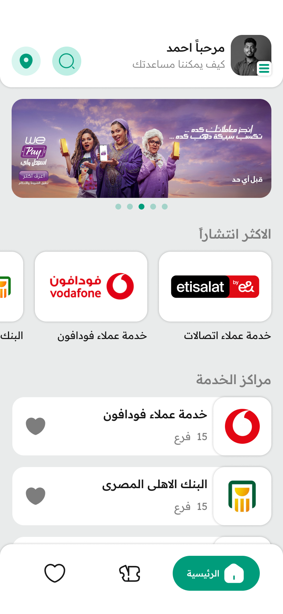
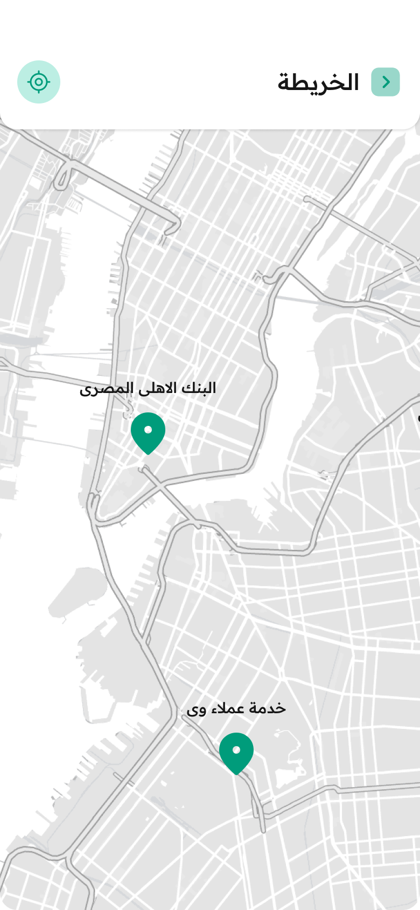
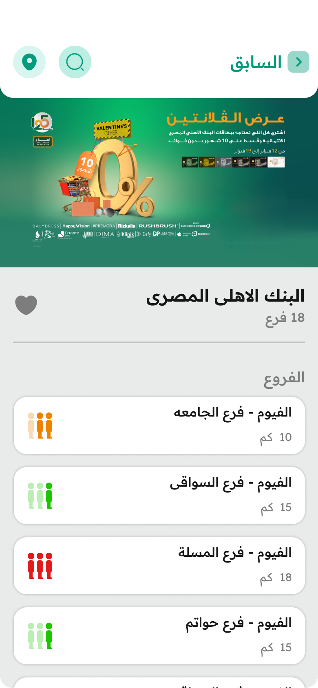

# Tabor

[](LICENSE)
[](https://github.com/AhmedHamdy85/Tabor)
[](https://github.com/AhmedHamdy85/Tabor/graphs/contributors)
[](https://github.com/AhmedHamdy85/Tabor/commits/main)

## 📱 Overview

Tabor is a mobile application designed to streamline queue management at banks, telecom service centers, and public service facilities. The app allows users to reserve a seat in a queue remotely, saving time and eliminating the need to physically wait in line.

## 🏆 Achievements

- This project was developed as a **graduation project** and earned an **A+ grade**.

## ✨ Features

- **Queue Reservation**: Book your place in a queue without being physically present
- **Real-time Updates**: Monitor your position in the queue and estimated waiting time
- **Service Provider Integration**: Connect with banks, telecom centers, and public service facilities
- **Notifications**: Receive alerts when your turn is approaching
- **User Profiles**: Manage your reservation history and preferences
- **Multi-platform Support**: Available for both Android and iOS devices

## 🛠️ Tech Stack

The app is built using the following technologies:

- **Flutter**: Cross-platform UI framework for building beautiful, natively compiled applications
- **Dart**: Primary programming language (94.5% of codebase)
- **SQLite**: Local database for storing user data and queue information
- **Cubit**: State management solution for predictable state handling
- **RESTful API**: Backend integration for real-time queue updates and data synchronization
- **Native Components**: Some features implemented in C++ (2.7%) and other languages for optimal performance

## 📱 Screenshots

## 📱 Screenshots (Continued)

## 📱 Screenshots

## 📱 Screenshots
## 📱 Screenshots

<div align="center">

<table>
  <tr>
    <td align="center"><br><b>Login Screen</b></td>
    <td align="center"><br><b>Home Screen</b></td>
    <td align="center"><br><b>Service Selection</b></td>
    <td align="center"><br><b>Form Submission</b></td>
  </tr>
  <tr>
    <td align="center"><br><b>Queue Request</b></td>
    <td align="center"><br><b>Map Screen</b></td>
    <td align="center"><br><b>Favorites Screen</b></td>
    <td align="center"><br><b>Branches Screen</b></td>
  </tr>
   <tr>
    <td align="center"><br><b>Settings Screen</b></td>
    <td align="center"><br><b>Sign up Screen</b></td>
    <td align="center"><br><b>ReTicket Screen</b></td>
    <td align="center"><br><b>form Screen</b></td>
  </tr>
</table>

</div>

## 🚀 Getting Started

### Prerequisites

- [Flutter SDK](https://flutter.dev/docs/get-started/install) (latest stable version)
- [Dart SDK](https://dart.dev/get-dart)
- Android Studio or VS Code with Flutter extensions
- iOS development tools (for Mac users)

### Installation

1. Clone the repository:
   ```bash
   git clone https://github.com/AhmedHamdy85/Tabor.git
   cd Tabor
   ```

2. Install dependencies:
   ```bash
   flutter pub get
   ```

3. Run the app:
   ```bash
   flutter run
   ```

## 📂 Project Structure

```
Tabor/
├── lib/                # Dart source code
│   ├── api/            # API integration
│   ├── cubit/          # State management
│   ├── models/         # Data models
│   ├── screens/        # UI screens
│   ├── services/       # Business logic
│   ├── utils/          # Utilities and helpers
│   └── main.dart       # Entry point
├── assets/             # Static assets (images, fonts)
├── ios/                # iOS-specific code
├── android/            # Android-specific code
├── test/               # Unit and widget tests
├── pubspec.yaml        # Project configuration
└── README.md           # Project documentation
```

## 💡 Usage

1. Register or log in to your account
2. Browse available service providers
3. Select the service you need
4. Reserve your place in the queue
5. Receive notifications about your queue status
6. Arrive at the venue just before your turn

## 🔄 How It Works

The app connects users with service providers through a seamless interface:

1. Service providers register their facilities and services
2. Users can see available queues and current waiting times
3. When a user reserves a spot, they receive a virtual ticket
4. The system updates queue positions in real-time
5. Users get notifications as their turn approaches

## 🤝 Contributing

Contributions are welcome! Here's how you can help:

1. Fork the repository
2. Create a feature branch (`git checkout -b feature/amazing-feature`)
3. Commit your changes (`git commit -m 'Add some amazing feature'`)
4. Push to the branch (`git push origin feature/amazing-feature`)
5. Open a Pull Request

Please make sure to update tests as appropriate and adhere to the coding standards.

## 📄 License

This project is licensed under the MIT License - see the [LICENSE](LICENSE) file for details.

## 📞 Contact

Ahmed Hamdy - [@AhmedHamdy85](https://github.com/AhmedHamdy85)

Project Link: [https://github.com/AhmedHamdy85/Tabor](https://github.com/AhmedHamdy85/Tabor)

---

⭐️ If you found this project helpful, please give it a star on GitHub! ⭐️
